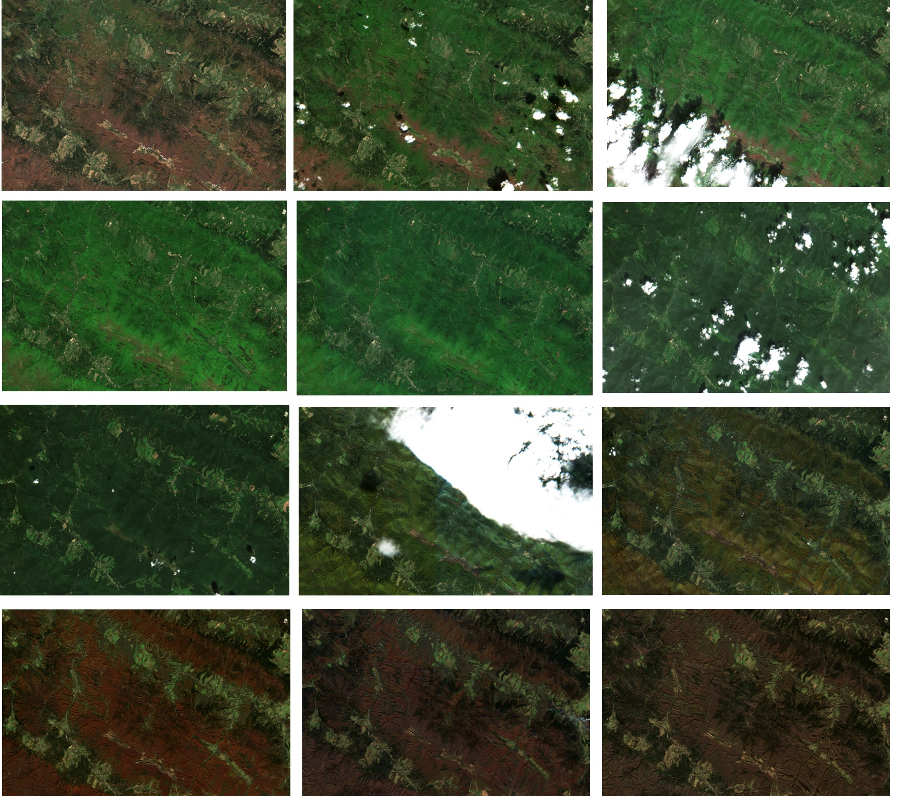
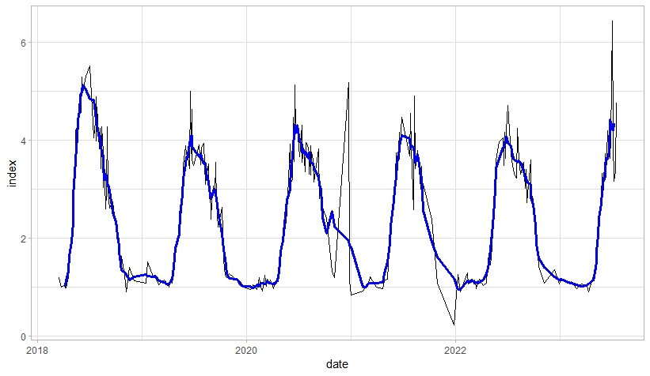

# OGH2023
Repository with materials for the "**Environmental analysis using satellite image time series in R**"
workshop on [OpenGeoHub Summer School 2023](https://opengeohub.org/summer-school/opengeohub-summer-school-poznan-2023/).

# What are satellite image time series?

Satellite time series are a collection of repeated observations or measurements obtained by satellites over a specific geographical area over a period of time.
Although these observations are typically captured at regular intervals, they are often irregular, particularly in the case of optical imagery, due to for example cloudiness. Still, they can be used in a wide range of applications, telling us how different objects or places have changed over time. 

Like in the example below - showing forests in part of the Bieszczady mountains, Poland during they year 2018. 

# What changes can we monitor based on satellite time series?
* phenology (seasonal patterns),
* abrubt changes, e.g. forest logging,
* gradual changes - increasing or decreasing trends,
* seasonal abrupt changes, e.g. meadow mowing
* ... 
 
# How can we do that?
Satellite imagery requires pre-processing, such as cloud masking, removing outliers etc. Still, they can be noisy, therefore different methods of smoothing are used. Sometimes, they also require regularizing or interpolation. 

See the example below showing raw indcies values derived from satellite imagery and a simple method of smoothing them (simple moving average).

