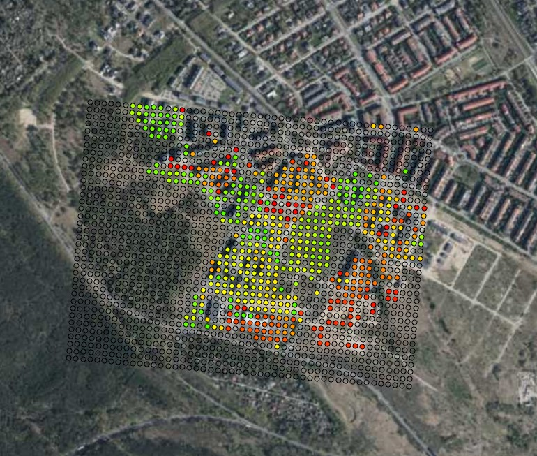

```{r setup, include=FALSE}
knitr::opts_chunk$set(echo = TRUE)
```
## Part 1: Pre-processing and smoothing satellite image time series
### Loading and pre-processing data

Load the packages:
```{r message=FALSE, warning=FALSE}
if (!require("pacman")) install.packages("pacman")
pacman::p_load("tidyverse", "tsibble", "bfast", "data.table", "mgcv","forecast", "zoo", "anytime", "fabletools", "signal", "fable", "tibble")
```


Import data - raw MTCI values from Sentinel-2 acquired from GEE:
```{r}
df = read.csv("d:/OGH2023_data/species_mtci.csv")
str(df)
summary(df)
```

As you can see, there is a lot of NA values, also, if we plot index values there are a lot of outliers. 
```{r}
plot(df$MTCI)
```


Modify column with date and change columns names:
```{r message=FALSE, warning=FALSE}
df$system.index = as.Date(df$system.index, format =  "%Y%m%d")
names(df) = c("date", "index", "type")
```

Filtering values, removing NA, mean of duplicates:
```{r message=FALSE, warning=FALSE}
df_clean = df %>% 
  drop_na() %>%
  group_by(date, type) %>%
  summarise(index = mean(index)) %>% 
  ungroup() %>%
  dplyr::filter(index < 7 & index > 0 & date > "2018-03-05") 

ggplot(df_clean, aes(date, index, color = type))+
  geom_point()+
  theme_light()
```


### Example analysis on hornbeam (GB) time series

```{r message=FALSE, warning=FALSE}
df_gb = df_clean %>%
  dplyr::filter(type == "GB")
ggplot(df_gb, aes(date, index))+
  geom_line(color = "darkgreen", linewidth = 1)+
  theme_light()
```

Firstly, identify and replace outliers using simple linear interpolation:
```{r}
df_gb$index_out = df_gb$index %>% 
  tsclean()

ggplot(df_gb)+
  geom_point(aes(date, index), color = "red")+
  geom_point(aes(date, index_out), color = "darkgreen")+
  theme_light()
```

### Smoothing 1: Simple Moving Average 

```{r message=FALSE, warning=FALSE}
df_gb$avg3 = rollmean(df_gb$index_out ,3, fill = NA)
df_gb$avg10 = rollmean(df_gb$index_out ,10, fill = NA)

ggplot(df_gb)+
  geom_line(aes(date, index_out))+
  geom_line(aes(date, avg3), color = "blue", linewidth = 1.0)+
  geom_line(aes(date, avg10), color = "red", linewidth = 1.0)+
  theme_light()
```

### Smoothing 2: Savitzky-Golay smoothing

We need to create regular (1-day) time series with NA for missing values.
And then interpolate the unknown values using na.approx() from the zoo package:
```{r message=FALSE, warning=FALSE}
df_tsb = tsibble(df_gb[,c(1,4)], index = date, regular = TRUE) %>%
  fill_gaps() %>%
  mutate(approx = na.approx(index_out))
```

Apply Savitzky-Golay filter. n is a filter length (odd number) - test different values.
```{r message=FALSE, warning=FALSE}
df_tsb$sg = df_tsb$approx %>%
  sgolayfilt(n = 71) 
```  


Analyze the results on plot - line represent time series smoothed by S-G, red dots - original values and blue dots - interpolated values
```{r message=FALSE, warning=FALSE}

ggplot(df_tsb)+
  geom_point(aes(date, approx), color = "blue", alpha = 0.2)+
  geom_point(aes(date, index_out), color = "red", alpha = 0.7)+
  geom_line(aes(date, sg), size = 1.1)+
  theme_light()
```

### Smoothing 3: Generalized Additive Models (GAM) fitting

The first step is the same as in Savitzky-Golay - we will create regular time series with NA values:
```{r message=FALSE, warning=FALSE}
df_tsb_gam = tsibble(df_gb[,c(1,4)], index = date, regular = TRUE) %>%
  fill_gaps() %>%
  ts() %>% #but here also we need to change date format from y-m-d to numeric (unix time)
  as.data.frame()
```

But now we can go straight to modelling without dealing with missing values!

GAM modelling with dates as predictor (Generalized Additive Mixed Models):
```{r message=FALSE, warning=FALSE}
model = gamm(df_tsb_gam$index_out ~ s(date, k = 60), 
             data = df_tsb_gam , method = "REML")
```

Predicting values using GAM model and plotting the results:
```{r message=FALSE, warning=FALSE}
df_tsb_gam$predicted = predict.gam(model$gam, df_tsb_gam)
df_tsb_gam$date = anydate(df_tsb_gam$date)

ggplot(df_tsb_gam)+
  geom_point(aes(date, index_out), color = "red", alpha = 0.4)+
  geom_line(aes(date, predicted), linewidth = 1)+
  theme_light()
```

Compare S-G (blue line) and GAM (black line):
```{r message=FALSE, warning=FALSE}
df_tsb_gam$sg = df_tsb$sg

ggplot(df_tsb_gam)+
  geom_point(aes(date, index_out), color = "red", alpha = 0.4)+
  geom_line(aes(date, predicted), alpha = 0.8, linewidth = 1)+
  geom_line(aes(date, sg), color = "blue", alpha = 0.8, linewidth = 1)+
  theme_light()
```

---

**Excercise 1** 

Read _landsat_ndvi_veg_2.csv_ file and analyze the dataframe.
Based on preliminary analysis, select one vegetation type, use cleaning/outlier removing if necessary, and perform one selected method smoothing/fitting. Finally, visualize the results and evaluate its performance!
Pay attention to:

* correctly convert system.index variable to date format (use e.g. substr() function)
* defining correct min and max values
* when using GAM, set appropriate knots number;

---

## Part 2: Detecting trends and breaks
In this part we will use Savitzky-Golay smoothing and then try to detect breaks and trends in satellite time series for the part of Poznań 

### Checking and smoothing selected pixels (samples)
Load the data (already pre-processed:)
```{r message=FALSE, warning=FALSE} 
df = read.csv("d:/OGH2023_data/poznan_ndvi_clean.csv")
str(df)
summary(df)
df = df[,-1]
df$system.index = as.Date(df$system.index, format = "%Y-%m-%d")
names(df) = c("date", "pointid", "index")


ggplot(sample_n(df, 5000), aes(date, index))+
  geom_point(alpha = 0.5)+
  theme_light()
```

Check examples examples with pointid 551 - vegetation development; 1311 and 472 - new built-up; 1623 conifer trees; 1149 built up to green space
```{r message=FALSE, warning=FALSE} 
df_sel = df %>%
  dplyr::filter(pointid %in% c(472, 551,1149,1311, 1623))

ggplot(df_sel, aes(date, index, 
                   group = pointid, color = as.factor(pointid)))+
  geom_line(linewidth = 1, alpha = 0.6)+
  scale_color_manual(values = c("#FF6666", "green", "purple", "#FF9900", "darkgreen"))+
  theme_light()
```

Let's now check the just the place with vegetation development and than smooth the time series: 
```{r message=FALSE, warning=FALSE} 
df_sel = df %>%
  dplyr::filter(pointid %in% c(551))
ggplot(df_sel, aes(date, index, 
                   group = pointid, color = as.factor(pointid)))+
  geom_line(linewidth = 1)+
  theme_light()
```

Based on previous part, we will use Savitzky-Golay smoothing - to make it easier you can find the function with all necessary steps (e.g. producing regular time series) and applying S-G function. The input for this is id (pointid in our loaded dataframe) and input_df, with 3 variables: date, id, and index value. 
```{r message=FALSE, warning=FALSE} 

sg = function(id, input_df) {
  df_sel = input_df %>%
    dplyr::filter(pointid == id)
  df_tsb = tsibble(df_sel[,c(1,3)], index = date, regular = TRUE) %>%
    fill_gaps() %>%
    mutate(approx = na.approx(index))
  df_tsb$sg = df_tsb$approx %>%
    sgolayfilt(n = 91) 
  df_tsb$id = id
  return(df_tsb[,-2])
}


sg(551, df) %>%
  ggplot()+
  geom_line(aes(date, sg), 
            alpha = 0.8, linewidth = 1)+
  theme_light()

```

### Time series decomposition

First example - vegetation development again:
```{r message=FALSE, warning=FALSE} 
df_sg = sg(551, df)

df_sg_ts = df_sg[,c(1,3)] %>%
  ts(frequency = 365)

df_sg_ts[,2] %>% decompose() %>%
  plot()
```

Second example - new built up area in the vegetated land:
```{r message=FALSE, warning=FALSE} 
df_sg = sg(1068, df)

df_sg_ts = df_sg[,c(1,3)] %>%
  ts(frequency = 365)

df_sg_ts[,2] %>% decompose() %>%
  plot()
```

Different method - stl: Seasonal Decomposition of Time Series by Loess:
```{r message=FALSE, warning=FALSE} 
df_sg_ts[,2] %>% 
  stl(s.window = 7) %>%
  plot()
```


### Detecting breaks 

Detect breaks using bfast function - firstly, apply S-G smoothing (the data should be a regular ts() object without NAs). This is the example for pixel no 1311.
```{r message=FALSE, warning=FALSE}

change1 = sg(1311, df) %>%
  select(date, sg) %>%
  ts(frequency = 365)
```

Use bfast function - which is an iterative break detection in seasonal and trend component of a time series; plot the results and the detected break date:
```{r message=FALSE, results='hide', warning=FALSE}
fit = bfast(change1[,2], h = 0.01, season = "harmonic", max.iter = 1, breaks = 1) 
plot(fit)
```
```{r message=FALSE, warning=FALSE}
anydate(change1[1] + fit$Time)
```


And another example 
```{r message=FALSE, results='hide', warning=FALSE}

change1 = sg(472, df) %>%
  select(date, sg) %>%
  ts(frequency = 365)
fit = bfast(change1[,2], h = 0.01, season = "harmonic", max.iter = 1, breaks = 1) 
plot(fit)
```
```{r message=FALSE, warning=FALSE}
anydate(change1[1] + fit$Time)
```


Another useful function is bfast01 which checks for one major break in the time series
```{r message=FALSE, results='hide', warning=FALSE}
fit = bfast01(change1[,2]) 
plot(fit)
```

Then these results can be, for example, joined with spatial data - and we can produce map of new built-up areas, like in the example below.

{width=50%}
 
 Still, method is not perfect, you can try testing other parameters! :) 


---

**Excercise 2 ** 

Use _landsat_ndvi_veg_2.csv_ dataframe again and decompose the time series for selected vegetation type!

---
